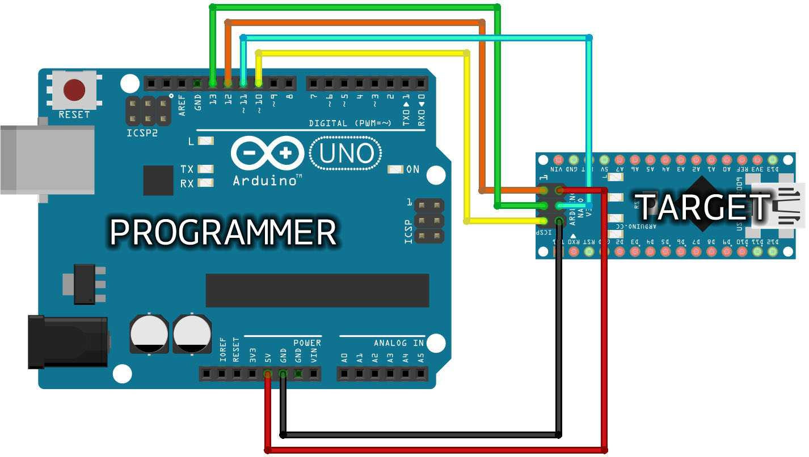

# Flashing the Bootloader on ATmega32U4 Using avrdude

This guide explains how to flash the bootloader onto an ATmega32U4 microcontroller using an Arduino as an ISP programmer and the `avrdude` command. This will also guide you through the necessary pin connections and explain the meaning of fuse settings.

## Prerequisites
- **ATmega32U4 microcontroller**: The target chip for the bootloader.
- **Arduino as ISP**: A second Arduino used to program the ATmega32U4 via ISP (In-System Programming).
- **avrdude**: The tool used to interface with the ATmega32U4 via the Arduino ISP.
- **Caterina Bootloader Hex File**: The bootloader file (`Caterina-promicro8.hex`) for the ATmega32U4.
- **AVRDUDE Configuration File**: `avrdude.conf` file.
- **Arduino IDE**: Required to upload the `ArduinoISP` sketch to the second Arduino.

## Hardware Setup

### Step 1: Connect the Arduino ISP to the ATmega32U4

To use one Arduino as an ISP programmer, connect the following pins between the two devices:

| **Arduino ISP Pin** | **ATmega32U4 Pin** | 
|---------------------|--------------------|
| **MOSI (D11)**   | MOSI            | 
| **MISO (D12)**   | MISO             | 
| **SCK (D13)**    | SCK               | 
| **SS (D10)**     | RESET             | 
| **GND**          | GND               | 
| **5V**           | **DO NOT CONNECT IT** |



**Note**: For this board, the power supply is 3.3V. So to correctly power the board be sure that a 3V3 device is used as programmer; otherwise do not connect the VCC of the programmer and power the target board via USB


### Step 2: Load the Arduino ISP Sketch

1. Open the Arduino IDE.
2. Select the board as **Arduino Uno** (or whichever Arduino you're using).
3. Go to **File > Examples > 11.ArduinoISP > ArduinoISP** and upload the sketch to your Arduino.

### Step 3: Verify the Connections

Make sure that the connections are correct as outlined in the table above before proceeding to the next steps.

## Flashing the Bootloader

Once the hardware is set up, you can flash the bootloader on the ATmega32U4 using `avrdude`.

### Step 4: Run avrdude to Flash the Bootloader

Run the following command from the terminal or command prompt:

```bash
avrdude -PCOM4 -C avrdude.conf -b19200 -cstk500v1 -pm32u4 -e -U flash:w:Caterina-promicro8.hex -U lfuse:w:0xFF:m -U hfuse:w:0xD8:m -U efuse:w:0xCB:m
```

### Explanation of the Command:

- `-PCOM4`: Specifies the COM port of the Arduino ISP programmer. You can check the port from your system's device manager (Windows) or `ls /dev/tty*` (Linux/macOS).
- `-C avrdude.conf`: Specifies the location of the `avrdude.conf` file, which contains configuration data for `avrdude`.
- `-b19200`: The baud rate for communication, set to `19200`.
- `-cstk500v1`: Specifies the programmer type. In this case, it uses the "stk500v1" protocol for Arduino ISP.
- `-pm32u4`: Tells `avrdude` to target the ATmega32U4 microcontroller.
- `-e`: Erases the flash memory of the ATmega32U4 before programming.
- `-U flash:w:Caterina-promicro8.hex`: Writes the bootloader (`Caterina-promicro8.hex`) to the flash memory of the ATmega32U4.
- `-U lfuse:w:0xFF:m`: Sets the low fuse to `0xFF` (using the external crystal oscillator with no prescaler).
- `-U hfuse:w:0xD8:m`: Sets the high fuse to `0xD8` (bootloader enabled).
- `-U efuse:w:0xCB:m`: Sets the extended fuse to `0xCB` (default protection settings).

### Step 5: Wait for the Process to Complete

`avrdude` will now write the bootloader to the ATmega32U4. Wait for the process to finish. You should see a message indicating successful programming.

## Fuse Explanation

Fuses are special bits stored in the ATmega32U4 that control the configuration of the microcontroller's hardware. The fuses set options such as the clock source, bootloader settings, and memory protection. In this case, we have three fuse settings:

- **LFUSE (Low Fuse) = 0xFF**:  
  This sets the clock source and prescaler for the ATmega32U4.  
  - `0xFF` means:
    - **External crystal oscillator** is used.
    - **No clock division** (prescaler = 1). The chip will run at the full 8 MHz frequency of the external crystal.

- **HFUSE (High Fuse) = 0xD8**:  
  This sets various options including the bootloader behavior.  
  - `0xD8` means:
    - **BOOTRST** is set to 1, which means the microcontroller will start executing the bootloader at reset (useful if you want to program the device via USB).
    - **Disable JTAG (optional)**.

- **EFUSE (Extended Fuse) = 0xCB**:  
  This controls settings like the bootloader size and EEPROM options.  
  - `0xCB` means:
    - **Bootloader size** set to 2048 bytes.
    - **No protection** is enabled on the EEPROM.

## Troubleshooting

- **"Verification Error"**: If you get a verification error after flashing the bootloader, try re-running the avrdude command with `-v` for verbose output to help diagnose the problem.
- **No COM port detected**: Ensure that the Arduino ISP is properly connected and that the correct port is selected in the `-PCOM4` part of the `avrdude` command.

---

This guide provides step-by-step instructions to program an ATmega32U4 with the **Caterina bootloader** using an Arduino as ISP and explains the fuse settings. Follow the steps carefully to ensure successful bootloader flashing.