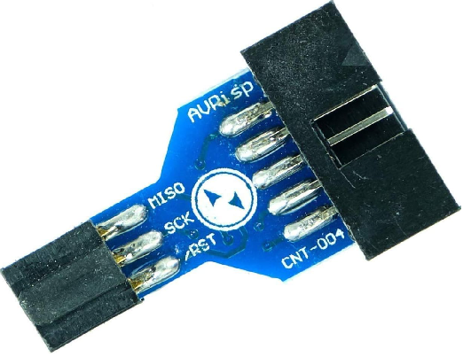

# Flashing the Bootloader on ATmega32U4 Using avrdude

This guide explains how to flash the bootloader onto an ATmega32U4 microcontroller
using a USBasp programmer and the `avrdude` command. It covers the necessary pin
connections and explains the meaning of fuse settings.

## Prerequisites

*   **ATmega32U4 microcontroller**: The target chip for the bootloader.
*   **USBasp programmer**: A low-cost USB programmer for Atmel AVR microcontrollers.
*   **avrdude**: The tool used to interface with the ATmega32U4 via the USBasp.
*   **Caterina Bootloader Hex File**: The bootloader file (`Caterina-promicro8.hex`)
    for the ATmega32U4.

## Hardware Setup

### Step 1: Connect the USBasp to the ATmega32U4

The USBasp exposes a standard 10-pin AVR ISP header. The pin numbering (odd pins
on the left column, even pins on the right column, pin 1 indicated by the triangle
or notch on the connector) is:

```
10-pin AVR ISP header (front view)
        ┌───────┬
 MOSI ← │  1  2 │ → VCC
   NC ← │  3  4 │ → GND
  RST ← │  5  6 │ → GND
  SCK ← │  7  8 │ → GND
 MISO ← │  9 10 │ → GND
        └───────┘
```

Connect the relevant signals to the ATmega32U4 as follows:

| 10-pin ISP Pin | Signal | ATmega32U4 Pin     |
| -------------- | ------ | ------------------ |
| 1              | MOSI   | MOSI               |
| 2              | VCC    | **CONNECTED ONLY IF 3.3V** |
| 4 / 6 / 8 / 10 | GND   | GND                |
| 5              | RST    | RESET              |
| 7              | SCK    | SCK                |
| 9              | MISO   | MISO               |

> **Note**: This board uses a 3.3 V power supply. Use VCC from USBasp
> only if it is able to provide 3.3V and **NOT** 5V, otherwise power the
> target board separately via USB.

#### Adapter for 6-pin ICSP Connectors

To simplify the connection with standard 6-pin ICSP header, you can use a 10-to-6 
pin ISP adapter to connect the USBasp directly without individual wires:



These adapters convert the USBasp 10-pin IDC connector to the 6-pin ICSP layout and
are widely available online.

### Step 2: Verify the Connections

Make sure the connections are correct as outlined in the table above before
proceeding to the next steps.

## Flashing the Bootloader

Once the hardware is set up, flash the bootloader on the ATmega32U4 using `avrdude`.

### Step 3: Program the Fuses

Because the crystal oscillator fuses may be incorrectly configured, the ISP clock
must be reduced to a very low speed (`-B400`) for the initial fuse programming step.

Run the following command from the terminal:

```bash
avrdude -cusbasp -pm32u4 -B400 -U lfuse:w:0xFF:m -U hfuse:w:0xD8:m -U efuse:w:0xCB:m
```

**Explanation of flags:**

*   `-cusbasp`: Selects the USBasp as the programmer.
*   `-pm32u4`: Targets the ATmega32U4 microcontroller.
*   `-B400`: Sets the ISP bit-clock period to 400 µs (very slow) to communicate
    reliably when the crystal is not yet configured correctly.
*   `-U lfuse:w:0xFF:m`: Sets the low fuse to `0xFF` (external crystal, no
    prescaler).
*   `-U hfuse:w:0xD8:m`: Sets the high fuse to `0xD8` (`BOOTRST` programmed so
    the chip resets into the bootloader; `BOOTSZ=00` selects the 4096-byte
    bootloader section).
*   `-U efuse:w:0xCB:m`: Sets the extended fuse to `0xCB` (Brown-Out Detection
    threshold at 2.4 V; Hardware Boot Enable pin disabled).

### Step 4: Flash the Bootloader

After the fuses are correctly set the chip can be programmed at full ISP speed.

Run the following command from the terminal:

```bash
avrdude -cusbasp -pm32u4 -e -U flash:w:Caterina-promicro8.hex
```

**Explanation of flags:**

*   `-cusbasp`: Selects the USBasp as the programmer.
*   `-pm32u4`: Targets the ATmega32U4 microcontroller.
*   `-e`: Erases the flash memory of the ATmega32U4 before programming.
*   `-U flash:w:Caterina-promicro8.hex`: Writes the Caterina bootloader to flash.

### Step 5: Wait for the Process to Complete

`avrdude` will write the bootloader to the ATmega32U4. Wait for the process to
finish. You should see a message indicating successful programming.

## Fuse Explanation

Fuses are special bits stored in the ATmega32U4 that control the hardware
configuration of the microcontroller, such as the clock source, bootloader settings,
and memory protection. This guide uses three fuse bytes:

*   **LFUSE (Low Fuse) = `0xFF`**: Selects the external crystal oscillator as the
    clock source with no clock division (prescaler = 1). The chip runs at the full
    8 MHz frequency of the external crystal.

*   **HFUSE (High Fuse) = `0xD8`** (`0xD8` = `0b11011000`):
    *   `BOOTRST` = 0 (programmed, active-low): the MCU jumps to the bootloader
        section on every reset, enabling USB programming.
    *   `BOOTSZ[1:0]` = `00` (both bits programmed): selects the maximum 2048-word
        (4096-byte) bootloader section.
    *   `SPIEN` = 0 (programmed): SPI programming interface enabled.

*   **EFUSE (Extended Fuse) = `0xCB`** (`0xCB` = `0b11001011`):
    *   `BODLEVEL[2:0]` = `011`: sets the Brown-Out Detection threshold to 2.4 V,
        preventing flash corruption if the supply voltage drops too low.
    *   `HWBE` = 1 (unprogrammed): the Hardware Boot Enable pin (HWB) is disabled;
        the bootloader is always entered on reset (see `BOOTRST` above).

## Troubleshooting

*   **Verification error**: Re-run the `avrdude` command with the `-v` flag for
    verbose output to help diagnose the problem.
*   **USBasp not detected**: Ensure the USBasp is properly connected via USB and
    that its drivers are installed. On Linux you may need to add a udev rule or run
    `avrdude` with `sudo`.

---

This guide provides step-by-step instructions to program an ATmega32U4 with the
**Caterina bootloader** using a USBasp programmer and explains the fuse settings.
Follow the steps carefully to ensure successful bootloader flashing.